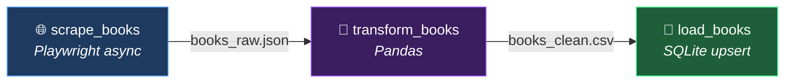

# 📚 Books ETL Pipeline: My Data Engineering Project

Hi there! Welcome to my end-to-end Data Engineering project. 

I built this **Extract → Transform → Load (ETL)** pipeline to demonstrate how to programmatically scrape data, clean it, and load it into a database while orchestrating the entire process inside Docker containers.

I chose to scrape [books.toscrape.com](https://books.toscrape.com), a sandbox bookstore website, pulling down all 1,000 books across 50 pages.

---

## 📸 Project Results

Here is what the final working pipeline looks like in action:

### 1. Fully Orchestrated with Apache Airflow
The entire process is automated using Apache Airflow. As you can see, the DAG runs perfectly, completing the `scrape_books`, `transform_books`, and `load_books` tasks in sequence!


### 2. The Final Database
After the pipeline finishes, all 1,000 books are perfectly cleaned and stored in a local SQLite database, ready for analysis.


### 3. Containerized with Docker
Everything runs in isolated Docker containers, so there's no "it works on my machine" issues. Airflow, PostgreSQL (for metadata), and the scraper all run in harmony.


*(Note: To make the images above show up in this README, create a folder named `docs` in this directory and save your screenshots there as `airflow_graph.png`, `db_browser.png`, and `docker_desktop.png`!)*

---

## 🏗️ Architecture Overview



| Step | Tool Used | Input | Output |
|------|-----------|-------|--------|
| **Extract** | Playwright (async) | books.toscrape.com | `books_raw.json` |
| **Transform**| Pandas | `books_raw.json` | `books_clean.csv` |
| **Load** | sqlite3 + Pandas | `books_clean.csv` | `books.db` |

---

## 🧠 How I Built It & My Design Choices

When building this, I wanted to simulate a real-world production environment. Here are a few technical decisions I made:

### 1. Extract: Why Async Playwright?
I could have used simple tools like `requests` and `BeautifulSoup`, but I wanted this scraper to be robust enough to handle modern JavaScript-heavy websites. I used **Async Playwright** to launch a headless browser. By using Python's `asyncio` and a `Semaphore(5)`, the script fetches 5 book detail pages at the exact same time! This drastically speeds up the scraping process while using a `0.7s` sleep timer so I don't overwhelm the website's server.

### 2. Transform: Cleaning with Pandas
The raw data comes back a bit messy. I used **Pandas** to:
- Convert string prices (like `"£51.77"`) into clean float numbers.
- Map text ratings (like `"Three"`) into actual integers (`3`).
- Strip out weird encoding artifacts and blank spaces.
- Deduplicate any rows just in case the scraper caught the same URL twice.

### 3. Load: Idempotent Database Upserts
I chose **SQLite** because it's portable—the database is just a single file (`data/books.db`) that anyone can open. However, I wrote the SQL query to be **idempotent** using `INSERT ... ON CONFLICT DO UPDATE`. This means you can run this pipeline 100 times, and it will never create duplicate books. It just updates the existing rows and refreshes the `scraped_at` timestamp!

---

## 🚀 How to Run It Yourself

Want to test it out? It's fully containerized, so it only takes a few commands:

### Prerequisites
- **Docker Desktop** installed and running.

### Steps
1. **Clone the repo and start Docker:**
   ```bash
   docker compose up --build
   ```
2. **Access the Orchestrator:**
   Open [http://localhost:8080](http://localhost:8080) in your browser.
   - **Username**: `admin`
   - **Password**: `admin`
3. **Trigger the Pipeline:**
   Find the **`books_etl_pipeline`** DAG, unpause it, and click the "Play" button to trigger it. 
4. **View the Data:**
   Once it finishes, open the `data/books.db` file using a tool like [DB Browser for SQLite](https://sqlitebrowser.org/) to see the results!

---
*Built with ❤️ using Python, Docker, and Airflow.*
